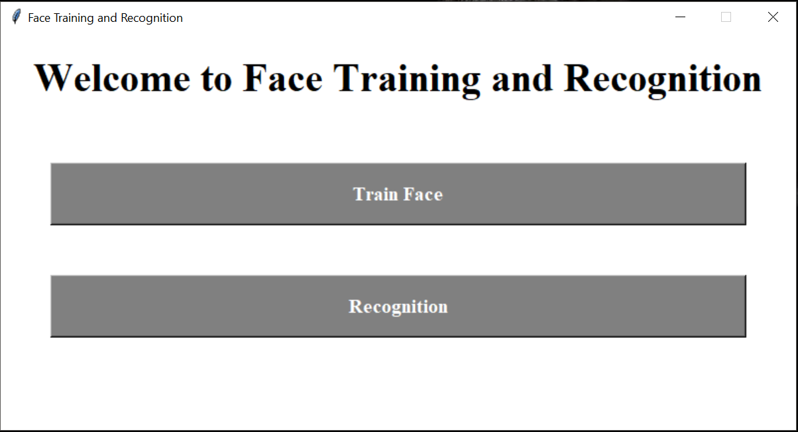

# Face Detection, Training and Recognition

```
Develop the application for face detection, training and recognition using python.
Application is used OpenCV-Python library to face detection, training and recognition.
In this application, you are trained the faces using given name and recognise the faces.
```

## Prerequisites

> Python https://www.python.org/downloads/

> Python libraries
		 - cv2&nbsp;&nbsp;&nbsp;&nbsp;&nbsp;&nbsp;&nbsp;&nbsp;&nbsp;&nbsp;`pip install opencv-python` 
		 - numpy&nbsp;&nbsp;&nbsp;&nbsp;&nbsp;`pip install numpy`
		 - pickle&nbsp;&nbsp;&nbsp;&nbsp;&nbsp;&nbsp;&nbsp;`pip install pickle5`
		 - PIL&nbsp;&nbsp;&nbsp;&nbsp;&nbsp;&nbsp;&nbsp;&nbsp;&nbsp;&nbsp;&nbsp;&nbsp;`pip install Pillow`
		 - tkinter&nbsp;&nbsp;&nbsp;&nbsp;&nbsp;&nbsp;`pip install python-tk`

## Method

> First, clone or download the source code from github

> Then, go to the root directory and type **`python UI.py`**

> After, train and recognise faces :+1:.

## Screenshots

### Home Window



### Face Training Window


### Face Recognition Window


